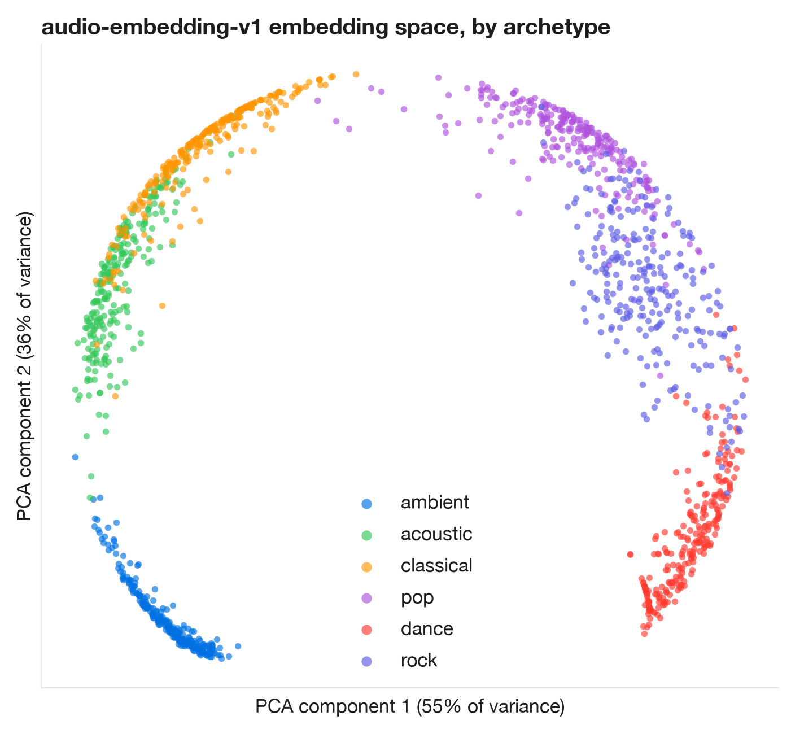
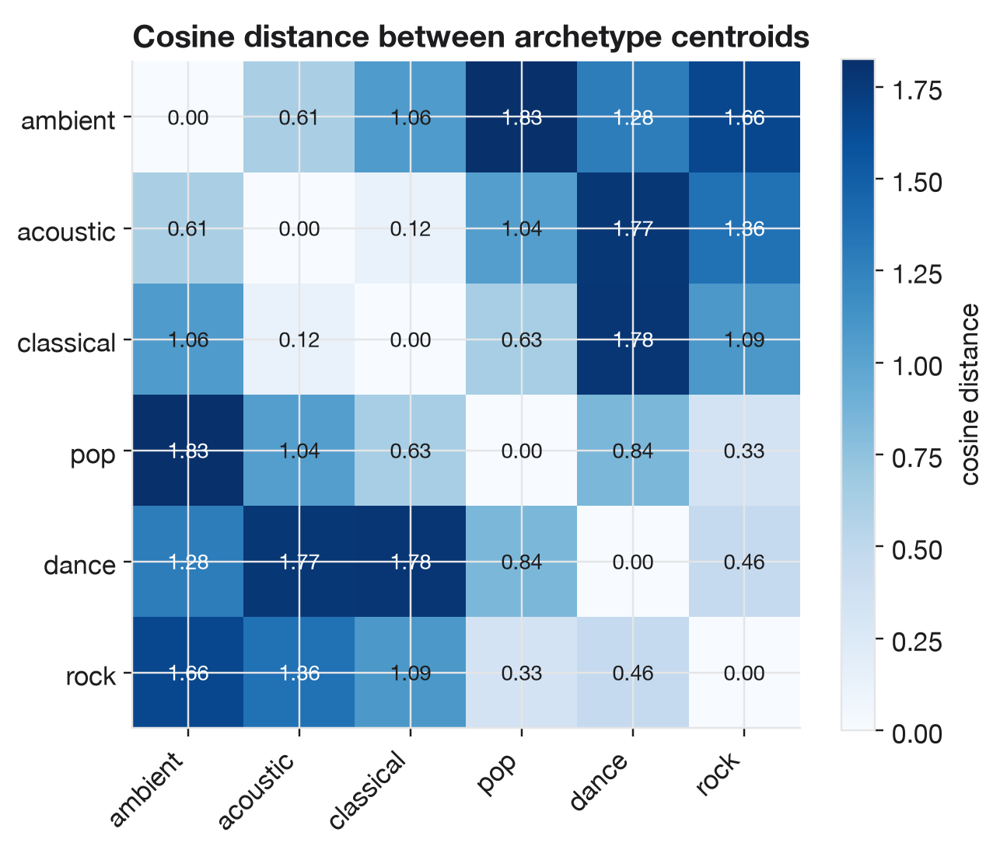
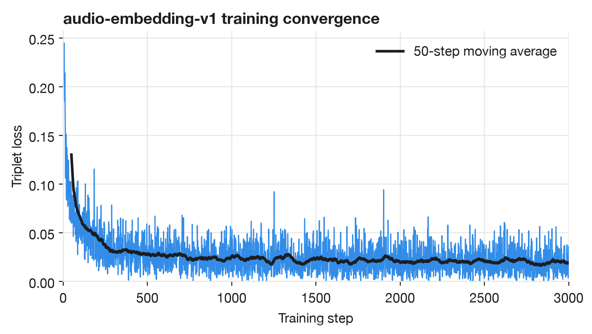
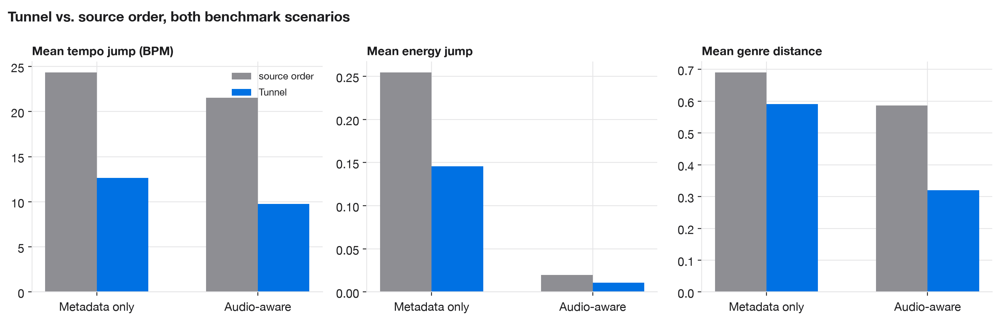
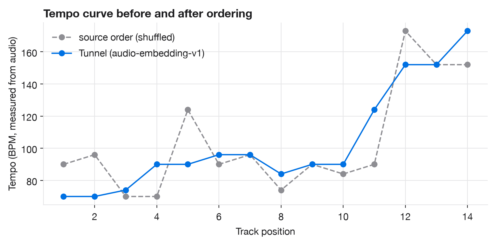
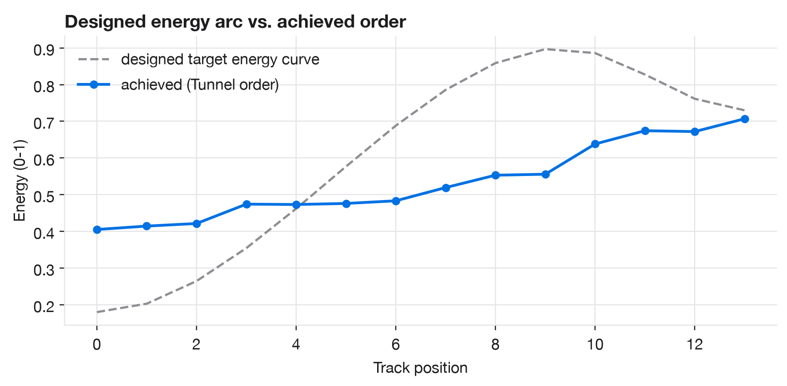

# Tunnel

[](https://github.com/Mayan10/tunnel/actions/workflows/ci.yml)
[](https://github.com/Mayan10/tunnel/releases)
[](LICENSE)
[](pyproject.toml)
[](https://developer.apple.com/documentation/coreml)
[](#requirements)

Tunnel is a terminal app that reorders Apple Music playlists into smoother listening flows. It runs a
Core ML model on-device, on the Apple Neural Engine, GPU, or CPU, to embed each track's audio
characteristics, then trains a lightweight ranker on top of that embedding for the specific playlist
being ordered. Everything happens locally: no network calls, no accounts, no cloud inference.

## How it works

1. **Read** the playlist from Apple Music and snapshot it to `~/.tunnel/snapshots/`.
2. **Decode** local audio with macOS `afconvert` and extract tempo, energy, brightness, dynamics, and
   a 4-band spectral split, all in pure Python.
3. **Embed** every track in one batched Core ML call. `audio-embedding-v1` is a compact feed-forward
   network trained with a triplet loss to place sonically similar tracks near each other in an
   8-dimensional space.
4. **Rank** transitions: a per-playlist model is trained on the source order in seconds, learning how
   much tempo, energy, brightness, dynamics, era, and embedding distance should each matter for *this*
   playlist, then builds a new order that minimizes jarring transitions.
5. **Write** the result as a new Apple Music playlist. The source playlist is never modified, and the
   track count is verified after every write.

<p align="center">
  
  
</p>

`audio-embedding-v1` is trained locally with a hand-rolled numpy triplet-loss network on procedurally
generated acoustic archetypes (ambient, acoustic, classical, pop, dance, rock) spanning realistic
tempo, energy, brightness, dynamics, and spectral-balance ranges. No real audio and no network access
are used in training; fully reproducible with `python3 tools/train_embedding_model.py`.

<p align="center">
  
</p>

## Requirements

- macOS with the Music app, Apple Silicon or Intel
- Python 3.11–3.13 ([Core ML's Python bridge doesn't yet ship 3.14 wheels](https://pypi.org/project/coremltools/))
- Apple Music automation permission for your terminal app
- Downloaded music files for audio analysis; cloud-only tracks can still be ordered on metadata alone

## Install

```bash
pipx install git+https://github.com/Mayan10/tunnel.git
```

Or with `pip`:

```bash
pip install git+https://github.com/Mayan10/tunnel.git
```

Or download the wheel from the [latest release](https://github.com/Mayan10/tunnel/releases/latest)
and `pip install tunnel-*.whl`.

## Use

```bash
tunnel
```

Opens the interactive app: choose a playlist, Tunnel analyzes it, previews the new order, and either
creates a new ordered playlist or saves the result as JSON.

Scriptable commands:

```bash
tunnel list
tunnel order "My Playlist" --create-playlist "My Playlist - Flow"
tunnel export "My Playlist" --out exports/my-playlist.json
tunnel restore "My Playlist - Before Tunnel abc123" --to "My Playlist Restored"
```

## Benchmarks

`scripts/benchmark_ordering.py` scores Tunnel against the unordered source playlist using three
metrics that don't depend on Tunnel's own cost function, so the comparison isn't self-graded: mean BPM
jump, mean audio energy jump, and mean genre-affinity distance between consecutive tracks. Lower is
smoother. Run it yourself with `python3 scripts/benchmark_ordering.py`.

Metadata only, bundled 10-track `tunnel/sample_playlist.json` (no local audio), shuffled first:

| Order                    | Tempo jump (BPM) | Energy jump | Genre distance |
| ------------------------ | ----------------: | ----------: | --------------: |
| source order (shuffled)  |              24.33 |       0.254 |            0.690 |
| Tunnel                   |              12.67 |       0.146 |            0.591 |

Audio-aware, 14 procedurally generated synthetic tracks (there is no real audio in this repo), shuffled first:

| Order                        | Tempo jump (BPM) | Energy jump | Genre distance |
| ----------------------------- | ----------------: | ----------: | --------------: |
| source order (shuffled)       |              21.54 |       0.020 |            0.586 |
| Tunnel (audio-embedding-v1)   |               9.77 |       0.011 |            0.320 |

<p align="center">
  
</p>

Tunnel doesn't just smooth tempo; it aims each playlist along a deliberate energy arc (ease in, build,
release near the end), then balances that target against keeping adjacent tracks close. The two don't
always fully agree, and Tunnel trades some closeness to the target curve for smoother transitions
between neighbors, visible below on the same synthetic playlist:

<p align="center">
  
  
</p>

These are small, synthetic benchmarks, not a study on real listening data, but they're honest: nothing
here is fabricated, and every number and every plot in this README is reproducible with `python3
tools/generate_report_assets.py`.

## Safety

Tunnel never mutates a source playlist. It always creates a new one and verifies the track count after
writing. It also snapshots the source playlist to `~/.tunnel/snapshots/` before every reorder, so
`tunnel restore` can rebuild it if needed.

## Development

```bash
pip install -e ".[dev]"
python3 -m unittest -v
ruff check .
mypy tunnel
```

See [CONTRIBUTING.md](CONTRIBUTING.md) for the full workflow, including retraining
`audio-embedding-v1`.

## License

Tunnel is licensed under the [MIT License](LICENSE).
